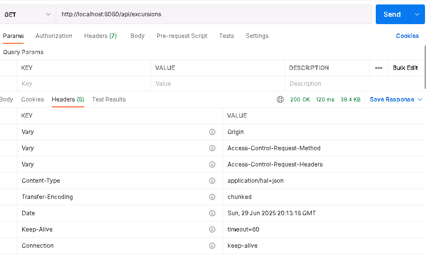
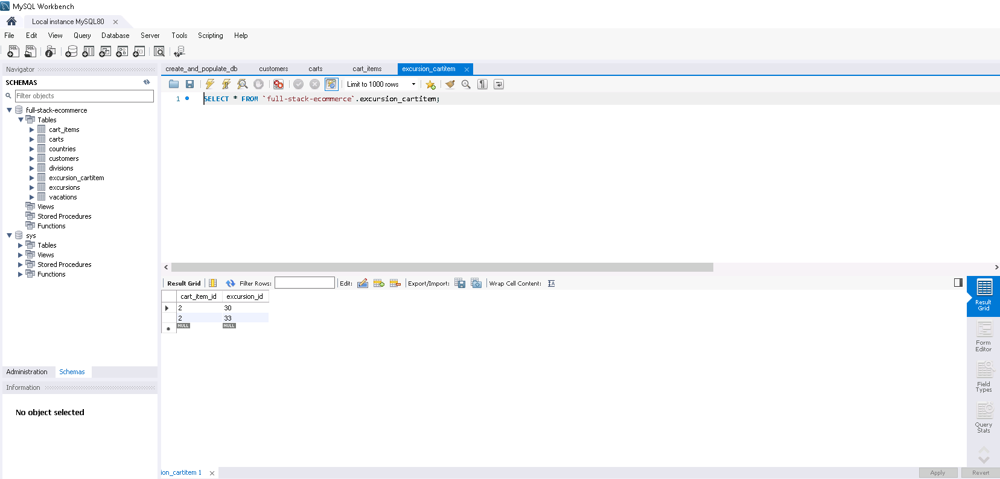

<h2> Vacation Reservation System – Backend</h2>

<strong></strong> The application allows customers to select vacation packages and excursions, fill out a checkout form, and submit an order.  
The backend exposes RESTful endpoints compatible with the Angular frontend and supports validation, order processing, and data persistence.

<h3>Features</h3>
<ul>
  <li>REST API fully integrated with Angular front-end</li>
  <li>Input validation for customer and cart info</li>
  <li>Add vacations + excursions to customer orders</li>
  <li>Auto-generates order tracking numbers</li>
</ul>

<h3>Project Structure</h3>
<pre>
demo
├── src
│   └── main
│       ├── java
│       │   └── com
│       │       └── example
│       │           └── demo
│       │               ├── config
│       │               ├── controllers
│       │               ├── dao
│       │               ├── entities
│       │               ├── services
│       │               └── DemoApplication.java
│       └── resources
└── pom.xml
</pre>

### Tech Stack

| Layer       | Technology                             |
|-------------|-----------------------------------------|
| **Backend** | Java 17, Spring Boot, Spring MVC        |
| **ORM**     | Spring Data JPA, Hibernate              |
| **API**     | Spring Data REST, RESTful JSON          |
| **Database**| MySQL 8, MySQL Workbench                |
| **Tools**   | Maven, Lombok, IntelliJ IDEA Ultimate   |
| **Frontend**| Angular (prebuilt, unmodified)          |
| **Versioning** | GitLab (commit tracking required)    |
| **Validation** | javax.validation (`@NotNull`, `@Size`) |

---

> 🚫 Note: Source code is kept private in accordance with WGU's Academic Authenticity Policy.  
> This repository contains only a high-level overview and does not expose any solution code.  

<h3>Screenshots</h3>

<h3> 1. Excursion API Endpoint Test (GET /api/excursions)  </h3> 

This captures the successful retrieval of excursion data via Postman. It verifies that the backend exposes excursion-related API and returns proper HAL+JSON with excursion_title, excursion_price, and related links.

---

 <h3> 2. MySQL Database: Excursion Cart Table  </h3>  

The MySQL Workbench screenshot shows the `excursion_cartitem` table from the database. It proves database records are correctly created and linked, enabling the backend to connect excursions to cart items.

